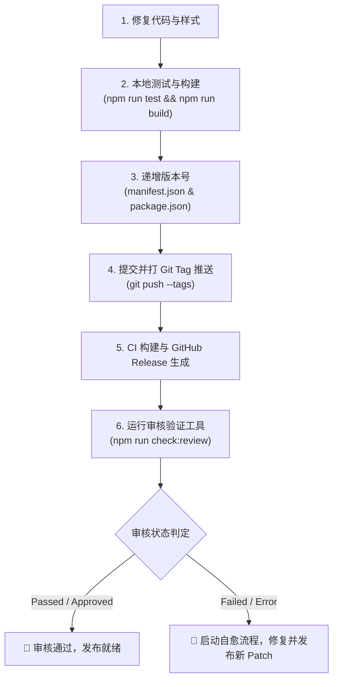

# Obsidian Plugin Agent Development & Review Verification Guide

本规范为 **Obsidian 百度网盘双向同步插件 (`baidu-netdisk-sync`)** 的核心开发准则与自动化规范。所有在此代码库工作的 AI Agent 与开发者均须严格遵循。

---

## 1. 凭据管理与安全边界 (Credential & Security Boundaries)

1. **严禁凭证入库**：
   - 绝不允许将 Obsidian 社区审核 Token (`obs_token`)、Cookie、百度开放平台 AppSecret、RefreshToken 等机密信息写入任何会被 Git 追踪的文件、提交信息或公开文档中。
2. **凭据存储标准**：
   - 本地凭据统一存储在项目根目录的 `.env` 文件中。
   - `.env` 以及 `.env.*` 已在 [`.gitignore`](file:///Users/sienchen/Documents/github_project/obsidian-baidu-netdisk-sync/.gitignore) 中强制忽略。
   - 公开的配置模板为 [`.env.example`](file:///Users/sienchen/Documents/github_project/obsidian-baidu-netdisk-sync/.env.example)。新增环境变量必须同步更新 `.env.example`。
3. **环境配置字段**：
   - `OBS_PLUGIN_URL`: 插件在 Obsidian 开发者平台的审核看板地址（默认：`https://community.obsidian.md/account/plugins/baidu-netdisk-sync`）。
   - `OBS_TOKEN`: Obsidian 开发者账号会话凭证（Cookie 中的 `obs_token`）。
   - `OBS_STRIPE_MID`: 可选的 Stripe 客户端标识（Cookie 中的 `__stripe_mid`）。

---

## 2. Obsidian 官方审核准则与编码规范 (Review Guidelines)

Obsidian 社区审核采用自动化扫描 Bot（包含 ESLint 及规则探测）+ 人工复审机制。必须时刻保持以下规范：

### 2.1 严禁直接内联样式赋值 (`obsidianmd/no-static-styles-assignment`)
- ❌ **违规示例**：
  ```ts
  el.style.marginBottom = "12px";
  textarea.style.width = "100%";
  ```
- ✅ **合规做法**：
  1. 在 [`styles.css`](file:///Users/sienchen/Documents/github_project/obsidian-baidu-netdisk-sync/styles.css) 中定义 CSS 类（以 `.baidu-sync-` 为命名空间前缀）。
  2. 使用 Obsidian 推荐方式挂载类名：
     ```ts
     const desc = containerEl.createDiv({ cls: "setting-item-description baidu-sync-modal-desc" });
     // 或
     el.addClass("baidu-sync-code-area");
     ```
  3. 如需动态修改计算属性，使用 Obsidian 提供的 `setCssStyles(el, ...)` 或 `setCssProps(...)`。

### 2.2 清单文件描述标点规范 (`manifest.json`)
- 官方校验 Bot 强制检查 `description` 末尾标点符号（正则 `[\.!?]$`）。
- ❌ 违规：末尾无标点，或以全角中文句号 `。` 结尾（会被判定非 ASCII 句点而报错/警告）。
- ✅ 合规：必须以标准英文半角标点（如 `.`）结尾：
  ```json
  "description": "Free cross-platform multi-device sync with Baidu Netdisk (iOS/Android/Desktop). 免费多端/多设备百度网盘双向同步."
  ```

### 2.3 窗口与 DOM 上下文访问 (`globalThis` 规避)
- ❌ 避免在涉及 DOM/Crypto 处使用裸 `globalThis`（在多窗口/Pop-out window 场景下可能无法正确定位目标视图窗口）。
- ✅ 优先使用当前 `window` 或 Obsidian 的 `activeWindow`。在 Node 测试环境下提供受控回退。

### 2.4 TypeScript 与 ESLint 严格模式
- 避免未受控的 `any` 类型转换。外部 JSON 解析一律使用 `unknown`，配合类型守卫断言。
- 移除多余的类型断言（如 `as ArrayBuffer` 当类型已匹配时）。
- `catch` 块中未使用的错误对象必须省略，例如 `try { ... } catch { ... }`。

---

## 3. 版本发布与审核验证标准 SOP (Release & Audit Verification SOP)

每次更新版本或修复代码后，必须按以下步骤推进：



### 步骤 1：本地构建与基准测试
```bash
npm run test
npm run build
```
确保单元测试 100% 通过，且 esbuild 打包无警告无报错。

### 步骤 2：版本号同步递增
每次发布新版本时，必须同步修改以下两处版本号：
1. [`package.json`](file:///Users/sienchen/Documents/github_project/obsidian-baidu-netdisk-sync/package.json) -> `version`
2. [`manifest.json`](file:///Users/sienchen/Documents/github_project/obsidian-baidu-netdisk-sync/manifest.json) -> `version`

### 步骤 3：提交与 Tag 推送
```bash
git add .
git commit -m "chore(release): vX.Y.Z"
git tag vX.Y.Z
git push origin main --tags
```
GitHub Actions ([`.github/workflows/release.yml`](file:///Users/sienchen/Documents/github_project/obsidian-baidu-netdisk-sync/.github/workflows/release.yml)) 会自动构建产物、生成 GitHub Attestation 并创建 Release。

### 步骤 4：执行在线审核状态验证
等待 GitHub Actions 发布完成后（通常 1-3 分钟），执行：
```bash
npm run check:review
```
该命令会自动从 `.env` 读取凭据，抓取并解析 Obsidian 官方审核系统看板：
- **Exit code 0**：状态为 `Passed` 或 `Approved`，审核顺利通过。
- **Exit code 1**：状态为 `Failed` 或存在阻塞性 `Error`，终端将格式化输出具体错误项与代码文件行号。

---

## 4. Agent 审查故障自愈流程 (Self-Healing Protocol)

当 `npm run check:review` 报告 `FAILED` 时，Agent 必须遵循以下自愈循环：

1. **溯源第一性原理**：阅读审核报告中的规则 ID（如 `obsidianmd/no-static-styles-assignment`）与定位的代码路径。
2. **原子化修复**：
   - 样式问题：移入 [`styles.css`](file:///Users/sienchen/Documents/github_project/obsidian-baidu-netdisk-sync/styles.css)，严禁使用 `style.xxx` 暴力修复。
   - 清单问题：修正 [`manifest.json`](file:///Users/sienchen/Documents/github_project/obsidian-baidu-netdisk-sync/manifest.json)。
   - API 废弃问题：根据 Obsidian API 文档引入渐进增强或类型适配。
3. **验证闭环**：
   - 运行 `npm run test` 与 `npm run build`。
   - 递增补丁版本号（Patch version），打新 Tag 重新触发 CI 发布并复验 `npm run check:review`。
